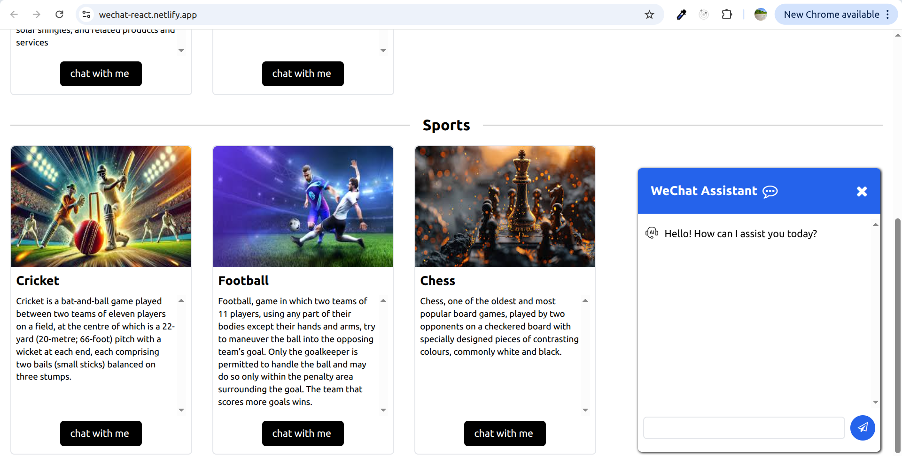
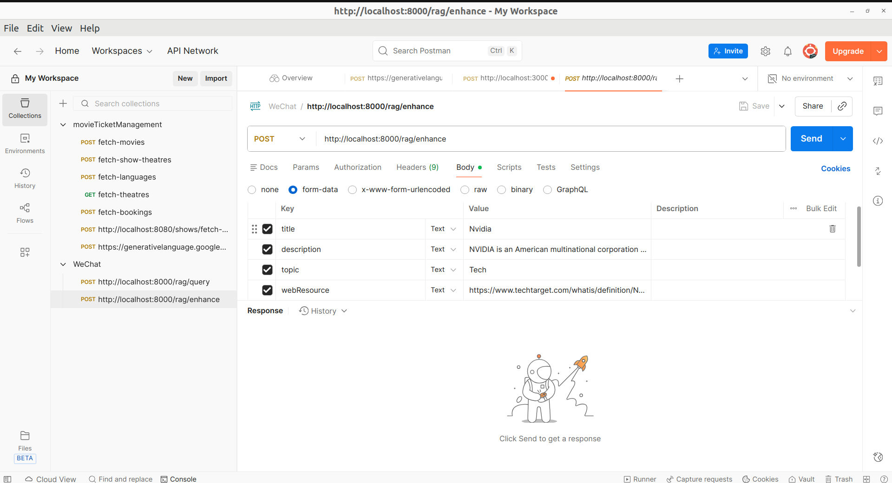

<h1>WeChat Frontend</h1>

WeChat backend repo: https://github.com/vishnuKumar3/wechat-backend

<h2>1. Application Name: WeChat</h2>

<h2>2. Description</h2>

WeChat is a modern AI-powered chat application built with React and Vite, designed to deliver an intuitive and interactive user experience. The application enables users to explore predefined topics and ask questions in natural language. Leveraging advanced AI capabilities, it understands user queries and provides accurate, context-aware responses based on the selected topic, making information retrieval simple, efficient, and conversational.

<h3>Tech Stack</h3>
<ul>
    <li>React</li>
    <li>Vite</li>
    <li>Tailwind CSS</li>
</ul>

<h2>3. Installation & Run Steps</h2>

<h3>Install Dependencies</h3>
<pre>
npm install
</pre>

<h3>Configure Environment Variables</h3>
<pre>
VITE_API_BASE_URL=http://localhost:8000
</pre>

<h3>Run Development Server</h3>
<pre>
npm run dev
</pre>

<h3>Build for Production</h3>
<pre>
npm run build
</pre>

<h2>4. Application Screenshots</h2>

<h3>Landing Page</h3>

 

<h3>Admin page to add topics(enhancing RAG knowledge)</h3>

